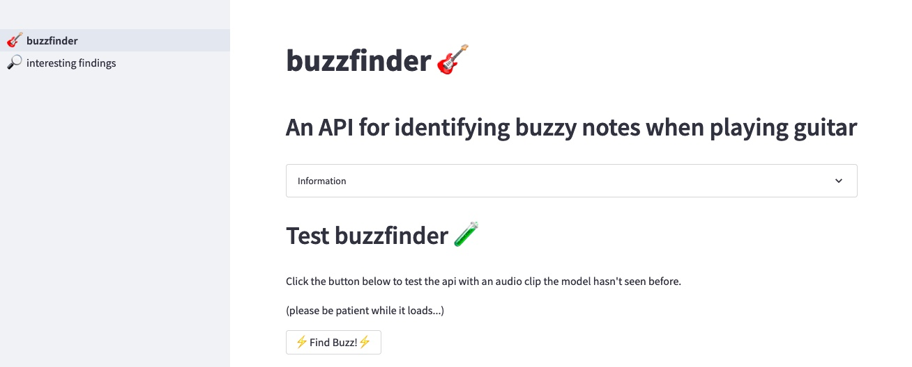

# buzzfinder
buzzfinder is an API that uses a deep learning CNN model to identify whether a note
played on the guitar has a clean, buzzy, or muted tone.  It takes a two second audio clip of a single guitar note as input, and outputs the predicted tone.

- Visit the [demo website](https://sevans47-buzzfinder-web--buzzfinder-03cgkc.streamlit.app/) to get a better understanding of the project. 🚀
- Feel free to visit the the [demo website's github](https://github.com/sevans47/buzzfinder_web) repo as well. 💻
- Check out the API itself [here](https://buzzfinder-classifier-v2-mnvqg6klaa-uc.a.run.app/). 🗄️



### purpose of buzzfinder

I plan to use the buzzfinder API for two future projects:

- *Identify all the buzzy or muted notes in a recording.* 🎤

This would help a guitarist to more quickly locate trouble spots, and help bring awareness to their playing.

- *Train a guitarist to better control their finger pressure.* 🤌

If a guitarist pushes on the strings too hard, they risk finger pain and possible injury. It also hurts their technique as they're less able to move smoothly and freely. A great exercise to remedy this problem is to push on the string lightly enough to play a buzzy note.  Then, push down just a bit more to make it a clean note, but using the least amount of pressure. The buzzfinder API could be used to teach new guitarists this important exercise.

# About creating the buzzfinder API
### data creation
There were several steps to create data for the model:
- buzzy, clean, and muted notes were recorded on the guitar (nearly 900 in total)
- two second clips of each note were extracted from the raw audio using librosa's onset detection, then organized, and saved
- all the clips were split into train / validate / test sets, and each clip in the train set was augmented using audiomentations' compose function (about 2600 clips in total)
- each clip was converted to mfcc data using librosa and saved in a json file

### model building
I made buzzfinder's model using a convolutional neural network that acheived 95.8% accuracy when classifying tones from my test set.
I created the model using TensorFlow's Keras library.  It has 3 convolusional layers, each one with normalization and max pooling layers. Next is a dense layer, followed by a final dense softmax output layer with three outputs for buzzy, clean, or muted predictions.

### API
The API's classify function takes a numpy array of a two second audio clip's mfccs, and returns a numpy array of predictions for each tone type.

### tools used
- **librosa** and **numpy**: process audio data from raw audio into comprehensive mfccs
- **audiomentations**: augment training data to make the model more robust
- **tensorflow keras**: build, train, and evaluate the CNN model
- **mlflow**: track and save models and evaluations
- **bentoml**: serve model over an HTTP API endpoint and create a docker container
- **google cloud platform (gcp)**: deploy api using container registry and cloud run

# Future improvements
Although buzzfinder's accuracy is nearly 96% with the test set, it needs more data to help it generalize better.  When I ran a test using my laptop mic, the accuracy fell to a bit below 60% 😱. I believe supplementing the dataset with the following audio data would help the most:
- Using different microphones (especially laptop mics)
- Using different picking techniques (this can add string noise similar to fret buzz)
- Using a variety of dynamics (the laptop mic recordings were much quieter than the test set)
- Using different types of guitars and strings (it's currently only trained using nylon strings)

# Documentation

### Installation
Create a python3 virtualenv and activate it:
```
sudo apt-get install virtualenv python-pip python-dev
deactivate; virtualenv -ppython3 ~/venv ; source ~/venv/bin/activate
```

Clone the project and install it:
```
git clone git@github.com:sevans47/buzzfinder.git
cd buzzfinder
pip install -r requirements.txt
make clean install test
```

### Getting two second audio clips from longer audio
python:
```
from buzzfinder.make_audio_clips import get_audio_clips, check_audio_clips
get_audio_clips(raw_audio_filename)
```

### How to create a dataset as a json file from audio clips
python:
```
from buzzfinder.prepare_dataset import main
main()
```
*note* the default datatype to convert audio clips to is comprehensive mfccs

### How to train a model
python:
```
from buzzfinder.train_model import main
main(use_mlflow=False)
```

### How to save models and results locally using MLflow
cli:
```
mkdir mlruns
make mlflow_create_experiment
make mlflow_launch_tracking_server
```

python:
```
from buzzfinder.train_model import main
main(use_mlflow=True)
```

### How to run tests
`make test`
